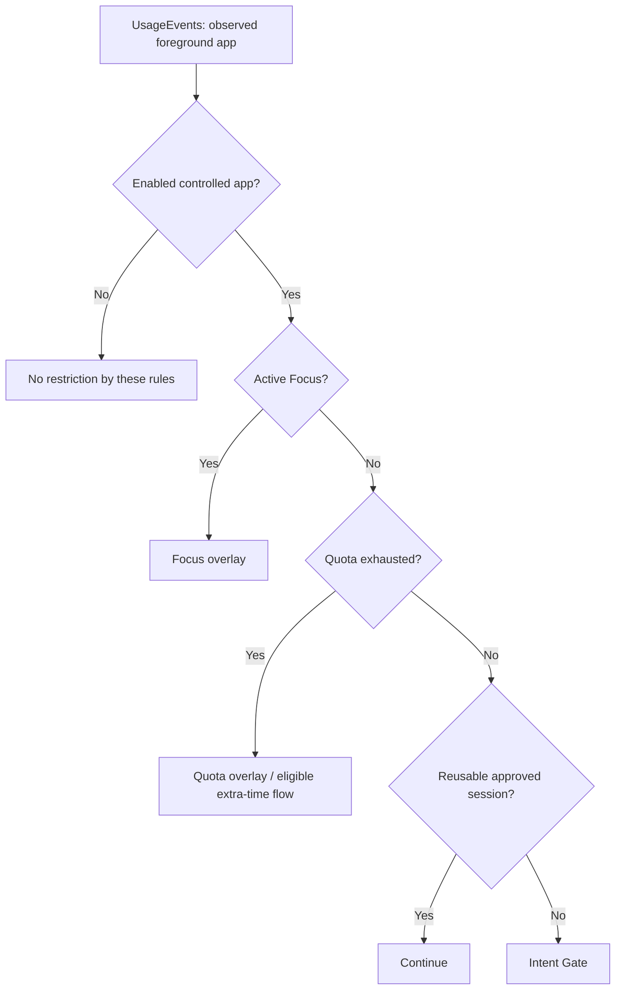

# 架构 / Architecture

本文记录 V1.0 当前实现，不提出架构改造。路径均相对于项目根目录。

This describes the existing V1.0 implementation, not a redesign. Paths are relative to the project root.

## 组件 / Components

以下 Kotlin 文件位于 `app/src/main/java/com/selfcontrol/app/`。

The Kotlin files below are under `app/src/main/java/com/selfcontrol/app/`.

| 文件 / File | 职责 / Responsibility |
| --- | --- |
| `MainActivity.kt` | Compose 首页、管理页、权限、额度编辑、专注及历史 / Compose home, management, permissions, quota editing, Focus and history |
| `MonitorService.kt` | 前台服务、使用事件轮询、规则决策、通知、健康检测与恢复尝试 / Foreground service, usage-event polling, rule decisions, notifications, health checks and recovery attempts |
| `OverlayController.kt` | Intent Gate 原生 View 悬浮窗 / Native View overlay for Intent Gate |
| `focus/FocusSessionStore.kt` | 专注时间、身份和结果持久化 / Persistence of Focus timestamps, identity and outcomes |
| `focus/FocusBlockedOverlayController.kt` | 专注限制窗口及其生命周期 / Focus restriction window and lifecycle |
| `quota/` | 额度计算、运行时状态、提醒阈值、额外时间和额度窗口 / Quota calculations, runtime state, thresholds, extra time and overlays |
| `usage/TodayUsageStatsReader.kt` | 从本地当天零点查询系统每日使用统计 / Queries daily system usage statistics from local midnight |
| `data/` | Room 数据库、实体与 DAO / Room database, entities and DAOs |

## 控制流程 / Decision flow

图表示稳定状态下的规则顺序：**Focus > Quota > Session > Gate**。配置加载中或额度快照缺失时，代码可能等待异步检查，不能把“没有结果”解释成已允许。继续使用和申请额外时间的回调会再次检查 Focus。

The diagram shows stable-state priority. Pending configuration loads or missing quota snapshots can defer decisions; missing evidence is not approval. Continue and extra-time callbacks recheck Focus.

监控轮询间隔为 1 秒；常规额度检查间隔为 30 秒，进入应用、规则更新或额外时间等路径可触发额外检查。Session 保存在服务内存中，离开不超过 5 分钟可复用。它不是 Focus 会话，也不是额外时间授权。

Monitoring polls every second. Routine quota checks are spaced 30 seconds apart, with additional checks on relevant transitions. App-session approval is service-local and reusable after an absence of at most five minutes. It is separate from a Focus session and an extra-time grant.

## 数据 / Data

| 存储 / Storage | 内容 / Contents |
| --- | --- |
| Room `self_control.db`，schema 4 | `controlled_app_configs`：包名、名称、启用标志、Gate 标志、额度、模式；`gate_events`：包名、时间、原因、动作 / Controlled-app settings and Gate event records |
| SharedPreferences `focus_session_state` | 专注开始、截止时间、会话 ID、自然完成或提前结束记录 / Focus start, deadline, identity, completed or early-ended results |
| `daily_quota_extra_time` | 每应用本地日期、额外分钟数、当日已申请标志 / Per-app local date, extra minutes and daily grant-used flag |
| `daily_quota_thresholds` | 当日已处理的提醒阈值 / Handled daily notification threshold |
| 服务内存 / Service memory | 前台观察、Session、额度快照、窗口与健康状态 / Foreground observation, app sessions, quota snapshots, overlay and health state |

Room 使用单线程 executor 处理读写，包含 1→2→3→4 迁移。首次建库会插入抖音默认配置。Focus 状态通过共享锁和 SharedPreferences 提交协调；到期在读取时结算，保留原计划截止时间。

Room work uses a single-thread executor and includes migrations 1→2→3→4. A new database seeds a Douyin configuration. Focus persistence uses a shared lock and SharedPreferences commits; expiry is settled on access using the original deadline.

## 健康与恢复边界 / Health and recovery limits

健康判断包含初始化、轮询成功、下次轮询已安排、前台读取及所需 Focus 窗口状态；心跳超时为 10 秒。恢复请求按 5 秒节流，服务返回 `START_STICKY`，另有进程内 Handler 恢复尝试。进程被终止后，Handler 不能继续运行；没有在 Manifest 中声明开机接收器。

Health checks cover initialization, successful polling, scheduling, foreground reads, and required Focus-window state, with a ten-second heartbeat timeout. Start retries are limited to five-second intervals. The service returns `START_STICKY` and also uses an in-process Handler for recovery attempts. That Handler cannot run after process termination; no boot receiver is declared.

窗口已附着、服务存在或计时保留，都不足以证明系统实际渲染、触摸拦截或后台持续运行。详见 [RC-H-001](COMPATIBILITY.md)。

Attachment, service existence, and persisted timers do not prove system rendering, touch interception, or uninterrupted background operation. See [RC-H-001](COMPATIBILITY.md).
